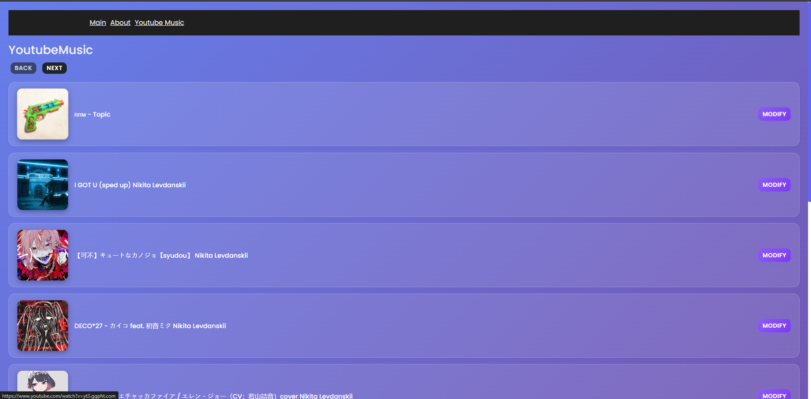
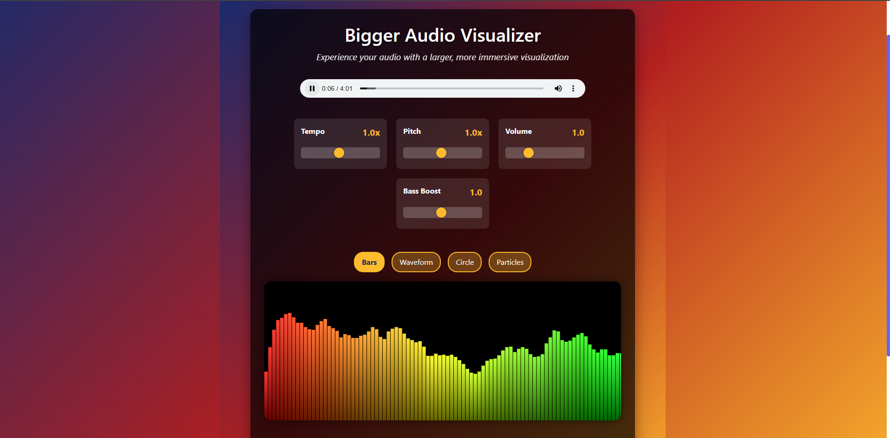

# SoundChangerBlazorServer

A powerful web-based audio processing and visualization application built with Blazor Server. This application allows users to manipulate audio files in real-time with various effects and visualize audio with immersive visualizations.

## 🎯 Features

### Audio Processing
- **Real-time Audio Effects**: Adjust tempo, pitch, and volume of audio files
- **Multiple Effect Controls**: 
  - Tempo modification (speed up/slow down)
  - Pitch shifting
  - Volume normalization
  - Audio routing options

### Audio Visualization
- **Immersive Visualizer**: Large-scale audio waveform visualization
- **Multiple Visualization Modes**:
  - Waveform display
  - Particle effects
  - Click-based visualization
- **Customizable Visual Settings**: Adjust size, intensity, and visualization parameters

### Music Integration
- **YouTube Music Support**: Search and process audio from YouTube Music
- **Spotify Authorization**: Integration with Spotify for music access
- **URL Processing**: Import audio by entering video URLs or titles

## 🛠️ Technology Stack

- **Frontend**: Blazor Server, C#, HTML5, CSS3
- **Audio Processing**: Custom audio manipulation libraries
- **Visualization**: Canvas-based rendering for real-time audio visualization
- **External APIs**: YouTube Music API, Spotify Web API

## 📸 Application Screenshots

### Main Interface

*Main application interface with file upload and music search functionality*

### YouTube Music Integration

*YouTube Music integration showing track listing and processing options*

### Audio Effects Control

*Real-time audio effects control panel with tempo, pitch, and routing options*

### Advanced Visualizer

*Immersive audio visualizer with customizable display settings*

## 🚀 Getting Started

### Prerequisites
- .NET 6.0 SDK or later
- Web browser with Web Audio API support
- (Optional) YouTube Data API key for YouTube Music features
- (Optional) Spotify Developer credentials for Spotify integration

### Installation

1. **Clone the repository**
   ```bash
   git clone https://github.com/YorickDano/SoundChangerBlazorServer.git
   cd SoundChangerBlazorServer
